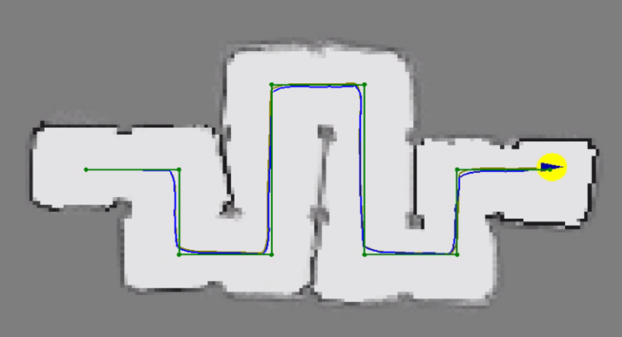

# Botlab (Fall 2023)

This repo contains the SLAM and motion controller solution code.

## Installation

To install, we need to build and install binaries, then install the SLAM and motion controller services to run on startup. You can use the install script, from the root of this repo:
```bash
./scripts/install.sh
```
The script will ask for the administrator password.

## Results

### CheckPoint 1
Fast Run:

[](https://github.com/user-attachments/assets/71d5defe-b30a-43f2-9b5c-22888b7098a4)


Slow Run:

[](https://github.com/user-attachments/assets/6f337a6f-ea33-4ad2-8510-eb6738889633)


### CheckPoint 2
SLAM Map:




# BotLab (Fall 2023)

This project was developed for the **ROB 550** course at the University of Michigan (Fall 2023). The focus of this lab is to build a full **autonomy stack** for a differential-drive robot using onboard sensors like LiDAR and odometry. The system includes modules for motion control, SLAM, path planning, and frontier-based exploration in a structured C++ framework.

---

**Table of Contents**
- [Code Structure](#code-structure)
- [How to Build](#how-to-build)
- [How to Run](#how-to-run)

---

## Code Structure

### 🔧 Core Components

- **[src](src)** – All source code organized by modules:
  - `mbot/`: Motion controller implementation for differential-drive and omnidirectional robots.
  - `slam/`: SLAM components including particle filter, scan matching, and occupancy grid mapping.
  - `planning/`: Path planning and exploration algorithms including A* and frontier-based exploration.
  - `utils/`: Utility functions for geometry, timing, and LCM support.

- **[include](include)** – Corresponding headers for all modules, separated by namespace.

- **[assets](assets)** – Contains visualizations and demo videos for checkpoint deliverables (e.g., `FastRun.mp4`, `map.png`).

- **[scripts](scripts)** – Installation and setup shell scripts.
  - `install.sh`: Installs dependencies and builds the workspace.

- **[services](services)** – Systemd service files for robot deployment:
  - `mbot-slam.service`, `mbot-motion-controller.service`

- **[build](build)** – Autogenerated folder by CMake after compilation (can be deleted and rebuilt).

- `CMakeLists.txt`: Project-level build file using CMake.

---

## ⚙️ How to Build

1. **Install LCM (Lightweight Communications and Marshalling)** if not already installed:
   ```bash
   sudo apt-get install liblcm-dev
   ```

2. **Build the project using CMake:**
   ```bash
   mkdir build && cd build
   cmake ..
   make -j4
   ```

---

## 🚀 How to Run

### Launch SLAM
```bash
./build/mbot_slam
```

### Launch Motion Controller
```bash
./build/mbot_motion_controller
```

### Launch Exploration or Planning Server
```bash
./build/exploration
# or
./build/motion_planning_server
```

> You can also set these up as systemd services using files in the `services/` directory for auto-start on boot.

---

## 📦 Dependencies

- C++17
- CMake
- LCM
- Eigen3
- GStreamer

---

## 🧠 Concepts Practiced

- Odometry & motion models
- Particle Filter SLAM
- LiDAR-based mapping
- A* path planning
- Frontier-based exploration
- Modular C++ software architecture

---

## 👥 Contributors

- Trushant Adeshara  
- Collaborators from ROB 550 (Fall 2023)

---

## 📜 License

This project is part of course-based work at the University of Michigan and follows the academic honor code for sharing.

---

