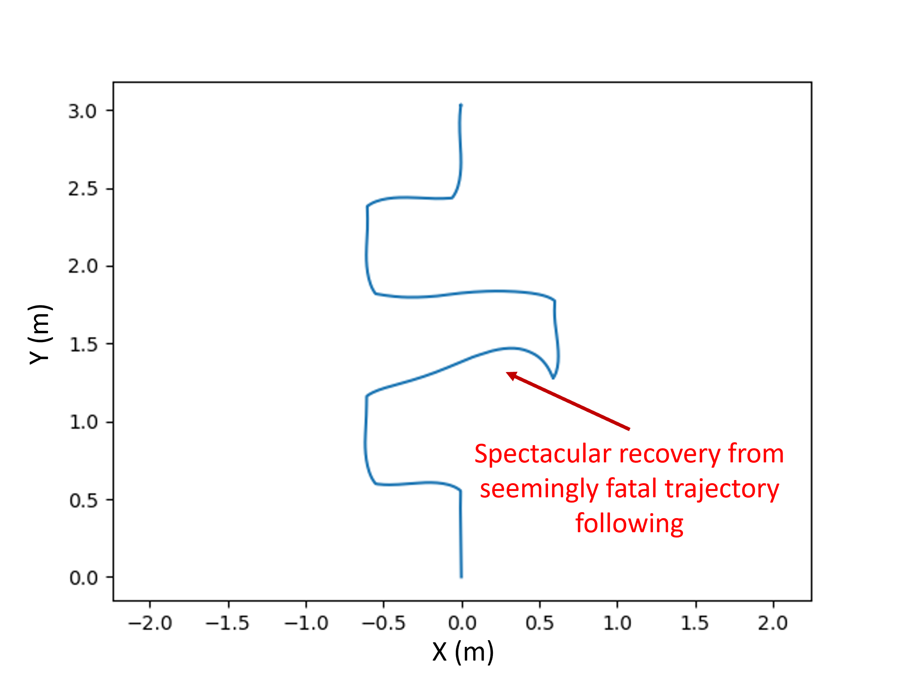
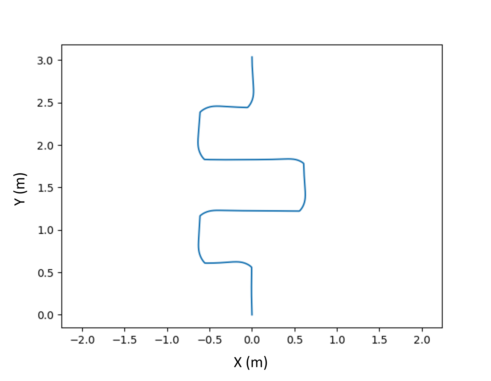

# MBot Autonomy

This repo contains the SLAM and motion controller solution code.

## Installation

To install, we need to build and install binaries, then install the SLAM and motion controller services to run on startup. You can use the install script, from the root of this repo:
```bash
./scripts/install.sh
```
The script will ask for the administrator password.

## Results

### CheckPoint 1
Fast Run:





